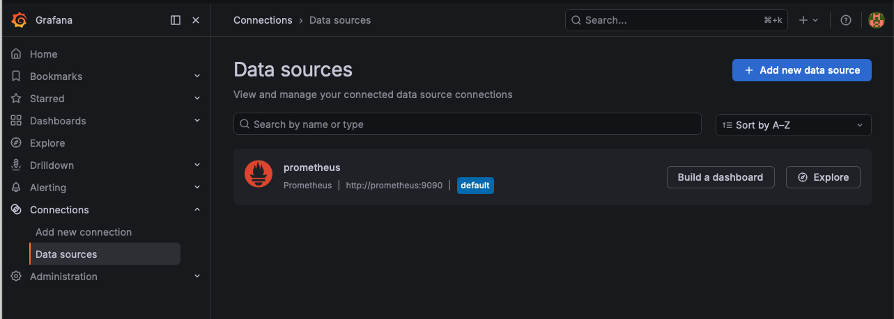
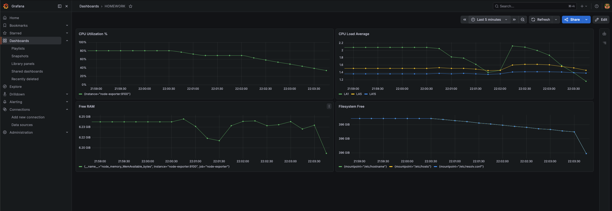
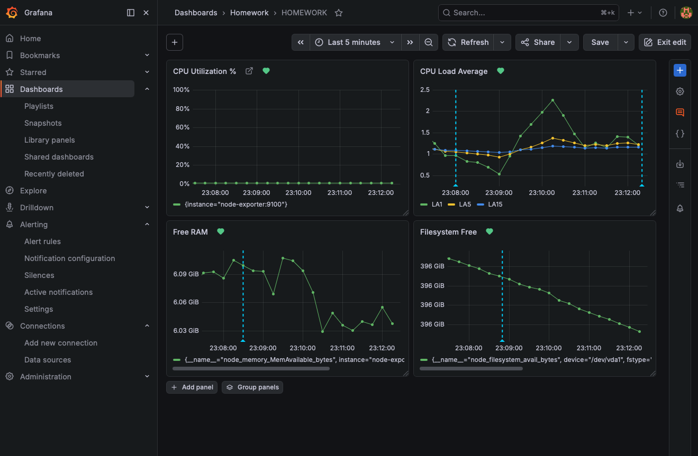
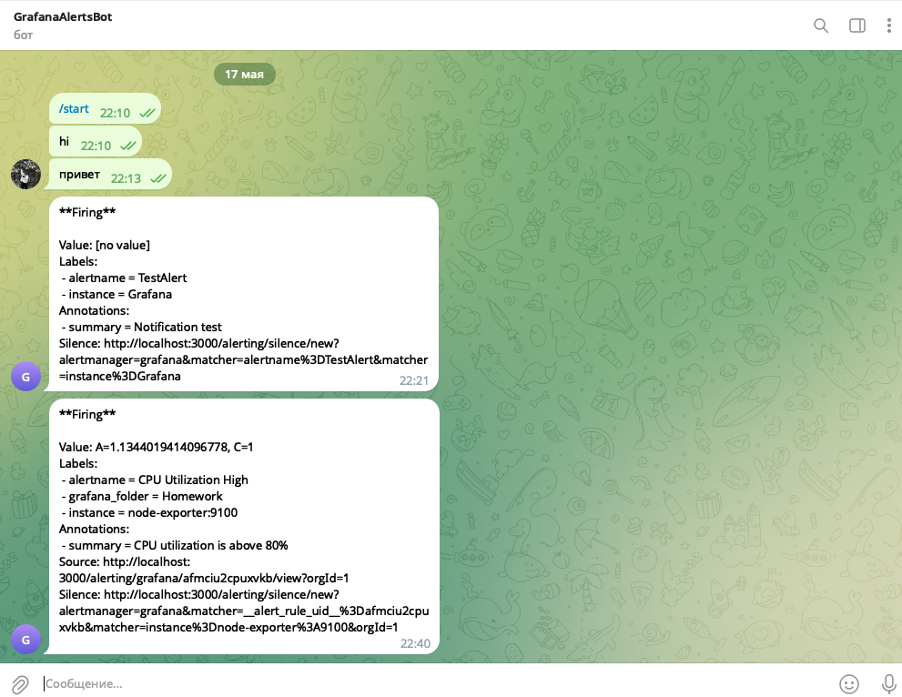

# Домашнее задание к занятию 14 «Средство визуализации Grafana» Савкин ИН

---

## Задание 1. Запуск Grafana + Prometheus + Node Exporter

Стек развёрнут самостоятельно без использования директории `help`, с помощью следующего `docker-compose.yml`:

```yaml
version: '3'
services:
  prometheus:
    image: prom/prometheus:latest
    container_name: prometheus
    volumes:
      - ./prometheus/prometheus.yml:/etc/prometheus/prometheus.yml
    command:
      - '--config.file=/etc/prometheus/prometheus.yml'
    ports:
      - "9090:9090"
    restart: unless-stopped

  node-exporter:
    image: prom/node-exporter:latest
    container_name: node-exporter
    restart: unless-stopped
    ports:
      - "9100:9100"

  grafana:
    image: grafana/grafana:latest
    container_name: grafana
    ports:
      - "3000:3000"
    environment:
      - GF_SECURITY_ADMIN_USER=admin
      - GF_SECURITY_ADMIN_PASSWORD=admin
    volumes:
      - grafana-data:/var/lib/grafana
    restart: unless-stopped
    depends_on:
      - prometheus

volumes:
  grafana-data:
```

Конфигурация Prometheus (`prometheus/prometheus.yml`):

```yaml
global:
  scrape_interval: 15s
  evaluation_interval: 15s

scrape_configs:
  - job_name: 'prometheus'
    static_configs:
      - targets: ['localhost:9090']

  - job_name: 'node-exporter'
    static_configs:
      - targets: ['node-exporter:9100']
```

Запуск:
```bash
docker compose up -d
```

Prometheus подключён как datasource в Grafana (`http://prometheus:9090`):



---

## Задание 2. Dashboard с панелями мониторинга

Создан Dashboard **HOMEWORK** с четырьмя панелями.

### PromQL-запросы

**CPU Utilization % (100 - idle):**
```promql
100 - (avg by(instance) (rate(node_cpu_seconds_total{mode="idle"}[5m])) * 100)
```

**CPU Load Average 1/5/15:**
```promql
node_load1   # Legend: LA1
node_load5   # Legend: LA5
node_load15  # Legend: LA15
```

**Свободная оперативная память:**
```promql
node_memory_MemAvailable_bytes
```

**Свободное место на файловой системе:**
```promql
node_filesystem_avail_bytes{device="/dev/vda1"}
```

Скриншот итогового Dashboard:



---

## Задание 3. Alert rules + уведомления в Telegram

Для каждой панели созданы правила алертинга в папке **Homework / Default**:

| Алерт | Условие |
|---|---|
| CPU Utilization High | IS ABOVE 80% |
| CPU Load Average | IS ABOVE 2 |
| Free RAM | IS BELOW 1 GB |
| Filesystem Free | IS BELOW 10 GB |

Настроен Contact Point **Telegram** (GrafanaAlertsBot).

Алерты привязаны к панелям дашборда — статус отображается сердечками (💚 Normal).

Скриншот Dashboard с привязанными алертами:



Тестовое событие Firing, полученное в Telegram:



---

## Задание 4. JSON-модель Dashboard

```json
{
  "apiVersion": "dashboard.grafana.app/v2",
  "kind": "Dashboard",
  "metadata": {
    "name": "adrjdz8",
    "namespace": "default",
    "uid": "7b050d24-6811-4901-a90b-640a518437bd",
    "resourceVersion": "1779048766912007",
    "generation": 24,
    "creationTimestamp": "2026-05-17T14:45:59Z",
    "labels": {
      "grafana.app/deprecatedInternalID": "2375844404305920"
    },
    "annotations": {
      "grafana.app/createdBy": "user:efmc67biu34lcb",
      "grafana.app/folder": "dfmcis4rp6qdca",
      "grafana.app/saved-from-ui": "Grafana v13.0.1+security-01 (9bbe672d)",
      "grafana.app/updatedBy": "user:efmc67biu34lcb",
      "grafana.app/updatedTimestamp": "2026-05-17T20:12:46Z",
      "grafana.app/folderTitle": "Homework",
      "grafana.app/folderUrl": "/dashboards/f/dfmcis4rp6qdca/homework"
    }
  },
  "spec": {
    "annotations": [
      {
        "kind": "AnnotationQuery",
        "spec": {
          "query": {
            "kind": "DataQuery",
            "group": "grafana",
            "version": "v0",
            "datasource": {
              "name": "-- Grafana --"
            },
            "spec": {}
          },
          "enable": true,
          "hide": true,
          "iconColor": "rgba(0, 211, 255, 1)",
          "name": "Annotations & Alerts",
          "builtIn": true
        }
      }
    ],
    "cursorSync": "Off",
    "editable": true,
    "elements": {
      "panel-1": {
        "kind": "Panel",
        "spec": {
          "id": 1,
          "title": "CPU Utilization %",
          "data": {
            "kind": "QueryGroup",
            "spec": {
              "queries": [
                {
                  "kind": "PanelQuery",
                  "spec": {
                    "query": {
                      "kind": "DataQuery",
                      "group": "prometheus",
                      "version": "v0",
                      "spec": {
                        "expr": "100 - (avg by(instance) (rate(node_cpu_seconds_total{mode=\"idle\"}[5m])) * 100)",
                        "legendFormat": ""
                      }
                    },
                    "refId": "A"
                  }
                }
              ]
            }
          },
          "vizConfig": {
            "kind": "VizConfig",
            "group": "timeseries",
            "spec": {
              "fieldConfig": {
                "defaults": {
                  "unit": "percent",
                  "min": 0,
                  "max": 100,
                  "thresholds": {
                    "mode": "percentage",
                    "steps": [
                      { "value": 0, "color": "green" },
                      { "value": 80, "color": "red" }
                    ]
                  }
                }
              }
            }
          }
        }
      },
      "panel-2": {
        "kind": "Panel",
        "spec": {
          "id": 2,
          "title": "CPU Load Average",
          "data": {
            "kind": "QueryGroup",
            "spec": {
              "queries": [
                {
                  "kind": "PanelQuery",
                  "spec": {
                    "query": {
                      "kind": "DataQuery",
                      "group": "prometheus",
                      "version": "v0",
                      "spec": { "expr": "node_load1", "legendFormat": "LA1" }
                    },
                    "refId": "A"
                  }
                },
                {
                  "kind": "PanelQuery",
                  "spec": {
                    "query": {
                      "kind": "DataQuery",
                      "group": "prometheus",
                      "version": "v0",
                      "spec": { "expr": "node_load5", "legendFormat": "LA5" }
                    },
                    "refId": "B"
                  }
                },
                {
                  "kind": "PanelQuery",
                  "spec": {
                    "query": {
                      "kind": "DataQuery",
                      "group": "prometheus",
                      "version": "v0",
                      "spec": { "expr": "node_load15", "legendFormat": "LA15" }
                    },
                    "refId": "C"
                  }
                }
              ]
            }
          },
          "vizConfig": {
            "kind": "VizConfig",
            "group": "timeseries",
            "spec": {
              "fieldConfig": {
                "defaults": {
                  "thresholds": {
                    "mode": "absolute",
                    "steps": [
                      { "value": 0, "color": "green" },
                      { "value": 2, "color": "red" }
                    ]
                  }
                }
              }
            }
          }
        }
      },
      "panel-3": {
        "kind": "Panel",
        "spec": {
          "id": 3,
          "title": "Free RAM",
          "data": {
            "kind": "QueryGroup",
            "spec": {
              "queries": [
                {
                  "kind": "PanelQuery",
                  "spec": {
                    "query": {
                      "kind": "DataQuery",
                      "group": "prometheus",
                      "version": "v0",
                      "spec": {
                        "expr": "node_memory_MemAvailable_bytes",
                        "legendFormat": "__auto"
                      }
                    },
                    "refId": "A"
                  }
                }
              ]
            }
          },
          "vizConfig": {
            "kind": "VizConfig",
            "group": "timeseries",
            "spec": {
              "fieldConfig": {
                "defaults": {
                  "unit": "bytes",
                  "thresholds": {
                    "mode": "absolute",
                    "steps": [
                      { "value": 0, "color": "green" },
                      { "value": 1000000000, "color": "red" }
                    ]
                  }
                }
              }
            }
          }
        }
      },
      "panel-4": {
        "kind": "Panel",
        "spec": {
          "id": 4,
          "title": "Filesystem Free",
          "data": {
            "kind": "QueryGroup",
            "spec": {
              "queries": [
                {
                  "kind": "PanelQuery",
                  "spec": {
                    "query": {
                      "kind": "DataQuery",
                      "group": "prometheus",
                      "version": "v0",
                      "spec": {
                        "expr": "node_filesystem_avail_bytes{device=\"/dev/vda1\"}",
                        "legendFormat": "__auto"
                      }
                    },
                    "refId": "A"
                  }
                }
              ]
            }
          },
          "vizConfig": {
            "kind": "VizConfig",
            "group": "timeseries",
            "spec": {
              "fieldConfig": {
                "defaults": {
                  "unit": "bytes",
                  "thresholds": {
                    "mode": "absolute",
                    "steps": [
                      { "value": 0, "color": "green" },
                      { "value": 10000000000, "color": "red" }
                    ]
                  }
                }
              }
            }
          }
        }
      }
    },
    "layout": {
      "kind": "GridLayout",
      "spec": {
        "items": [
          { "kind": "GridLayoutItem", "spec": { "x": 0,  "y": 0, "width": 12, "height": 8, "element": { "kind": "ElementReference", "name": "panel-1" } } },
          { "kind": "GridLayoutItem", "spec": { "x": 12, "y": 0, "width": 12, "height": 8, "element": { "kind": "ElementReference", "name": "panel-2" } } },
          { "kind": "GridLayoutItem", "spec": { "x": 0,  "y": 8, "width": 12, "height": 8, "element": { "kind": "ElementReference", "name": "panel-3" } } },
          { "kind": "GridLayoutItem", "spec": { "x": 12, "y": 8, "width": 12, "height": 8, "element": { "kind": "ElementReference", "name": "panel-4" } } }
        ]
      }
    },
    "title": "HOMEWORK",
    "timeSettings": {
      "timezone": "browser",
      "from": "now-30m",
      "to": "now"
    }
  }
}
```
